# MCP Trading Memory

[](https://www.python.org/downloads/)
[](https://modelcontextprotocol.io/)
[](https://opensource.org/licenses/MIT)

> ⚠️ **Note:** This project is actively under development and subject to change. APIs and architecture may evolve as testing and feature integration progress. I'll make the code repo public after additional testing. 

**Trading memory system for AI assistants via Model Context Protocol (MCP)**

Persistent memory capabilities designed for trade-copilot integration. Prevents contradictory signals, maintains trading context, and enforces consistency across trading sessions.

## Architecture Overview


### Trade Copilot Integration

Add to `trade-copilot/mcp_servers.json`:

```json
{
  "mcpServers": {
    "trading-memory": {
      "command": "mcp-trading-memory",
      "args": [],
      "env": {
        "MEMORY_BACKEND": "redis",
        "REDIS_URL": "redis://localhost:6379",
        "BIAS_CHANGE_GATE_MINUTES": "15",
        "SESSION_MEMORY_TTL": "86400"
      }
    },
    "market-data": {
      "command": "mcp-market-data-server"
    },
    "order-flow": {
      "command": "mcp-order-flow-server"
    }
  }
}
```

## Memory Tools

### Core Memory Operations

#### `get_current_bias`
Retrieves established market bias and timing context for symbol

```json
{
  "name": "get_current_bias",
  "arguments": {
    "symbol": "SPY"
  }
}
```

**Returns:**
```json
{
  "bias": "bullish",
  "established_at": "2024-01-15T09:45:00Z",
  "confidence": 85,
  "invalidation_level": 471.50,
  "time_held_minutes": 23,
  "reasoning": "Breaking above VWAP with volume confirmation"
}
```

#### `store_trading_decision`
Stores important trading decisions with context

```json
{
  "name": "store_trading_decision",
  "arguments": {
    "symbol": "SPY",
    "decision_type": "bias_establishment",
    "content": {
      "bias": "bullish",
      "reasoning": "Breaking above VWAP with volume",
      "confidence": 85,
      "invalidation_level": 471.50,
      "key_levels": {
        "support": 470.25,
        "resistance": 473.80
      }
    }
  }
}
```

#### `check_consistency`
Validates new signals against recent decisions

```json
{
  "name": "check_consistency",
  "arguments": {
    "symbol": "SPY",
    "proposed_bias": "bearish",
    "reasoning": "Failed breakdown attempt",
    "proposed_action": "sell_calls"
  }
}
```

**Returns:**
```json
{
  "consistent": false,
  "conflicts": [
    {
      "type": "time_gate",
      "message": "Bias change within 15 minutes of establishment",
      "last_change": "2024-01-15T09:45:00Z"
    },
    {
      "type": "position_conflict", 
      "message": "Contradicts existing bullish position",
      "current_position": "long_calls_473"
    }
  ],
  "recommendation": "wait_or_justify"
}
```

#### `get_active_positions`
Retrieves current positions with entry context

```json
{
  "name": "get_active_positions",
  "arguments": {
    "symbol": "SPY"
  }
}
```

#### `get_pattern_memory`
Searches historical patterns and outcomes

```json
{
  "name": "get_pattern_memory",
  "arguments": {
    "setup_type": "vwap_breakout",
    "market_condition": "low_volatility",
    "time_of_day": "morning",
    "limit": 5
  }
}
```

#### `update_position`
Updates position status and reasoning

```json
{
  "name": "update_position",
  "arguments": {
    "symbol": "SPY",
    "position_id": "pos_001",
    "status": "active",
    "current_pnl": 150.50,
    "notes": "Target hit, trailing stop"
  }
}
```

## Trading Workflow Scenarios

### Scenario 1: Morning Bias Establishment


### Scenario 2: Position Entry with Memory Check


### Scenario 3: Conflicting Signal Prevention


### Scenario 4: Pattern Recognition Workflow


### Scenario 5: Real-time Status Check ("Check Now")


### Scenario 6: Contradictory Signals Problem & Solution

#### Part A: WITHOUT Memory (Contradictory Signals)

```mermaid
sequenceDiagram
    participant TC as Trade Copilot
    participant LLM as LLM Service (No Memory)
    participant MD as Market Data
    
    Note over TC,MD: 9:45 AM - First Analysis
    
    TC->>LLM: "Analyze SPY"
    LLM->>MD: get_market_data("SPY")
    MD-->>LLM: Price 472.80, above VWAP, strong volume
    LLM-->>TC: "🟢 BULLISH: Buy SPY 473 calls"
    
    Note over TC,MD: 9:52 AM - Second Analysis (7 mins later)
    
    TC->>LLM: "How's SPY looking?"
    LLM->>MD: get_market_data("SPY")
    MD-->>LLM: Price 472.60, slight pullback, volume decreasing
    LLM-->>TC: "🔴 BEARISH: Consider SPY puts, momentum fading"
    
    Note over TC,MD: 9:58 AM - Third Analysis (6 mins later)
    
    TC->>LLM: "SPY update please"
    LLM->>MD: get_market_data("SPY")
    MD-->>LLM: Price 472.75, back near VWAP
    LLM-->>TC: "🟢 BULLISH: Good entry for calls again"
    
    Note over TC,MD: Result: 3 contradictory signals in 13 minutes!
```



#### Part B: WITH Memory (Consistent Analysis)


### Scenario 7: Memory-Based Contradiction Detection


### Scenario 8: End of Session Memory Update


## Contradictory Signals Problem Analysis

### The Problem: AI Memory Loss
Without persistent memory, AI trading assistants suffer from "conversational amnesia" - each query is analyzed in isolation, leading to contradictory recommendations within minutes.


### The Solution: Memory-Driven Consistency


### Memory Tools That Solve This

| Problem | Memory Tool | How It Helps |
|---------|-------------|--------------|
| **Bias Flip-Flopping** | `get_current_bias` + `check_consistency` | Maintains established bias, prevents rapid changes |
| **Position Conflicts** | `get_active_positions` + position validation | Prevents recommendations that contradict holdings |
| **Panic Decisions** | Time gates + invalidation levels | Enforces professional discipline and exit rules |
| **Context Loss** | `get_pattern_memory` | Provides historical context for current setup |
| **Status Confusion** | Real-time status synthesis | Combines memory + fresh data for complete picture |


## Tool Integration Patterns

### Pre-Decision Memory Check


### Memory Update Flow


## Configuration

### Environment Variables
```bash
# Storage Backend
MEMORY_BACKEND=redis
REDIS_URL=redis://localhost:6379/0

# Consistency Rules
BIAS_CHANGE_GATE_MINUTES=15
MAX_CONTRADICTIONS_HOUR=2
POSITION_CONSISTENCY_CHECK=true

# Memory Management  
SESSION_MEMORY_TTL=86400
PATTERN_MEMORY_TTL=2592000
CONVERSATION_MEMORY_LIMIT=50

# Trading Rules
MAX_POSITION_SIZE=10000
RISK_LIMIT_PERCENT=2.0
TIME_STOP_MINUTES=240
```


## Memory Lifecycle

### Session Lifecycle


## License

MIT License - see [LICENSE](LICENSE) for details.

## Disclaimer

This software is for educational and research purposes. Trading involves risk of loss.
