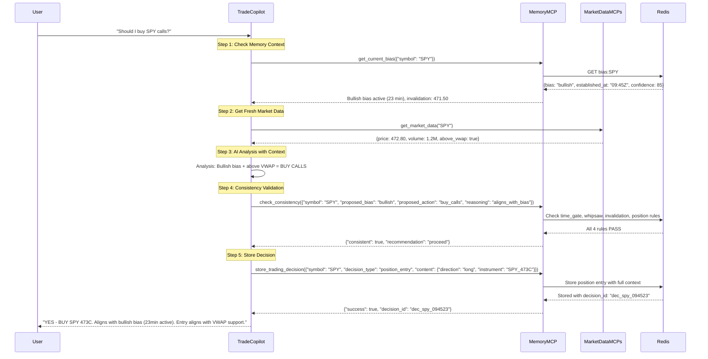
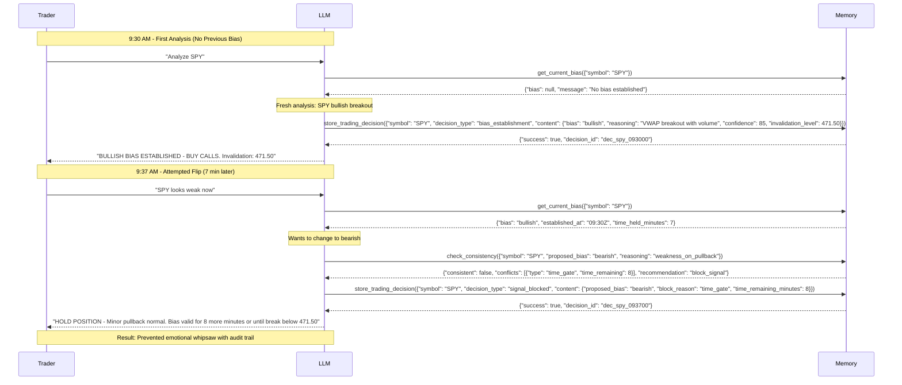
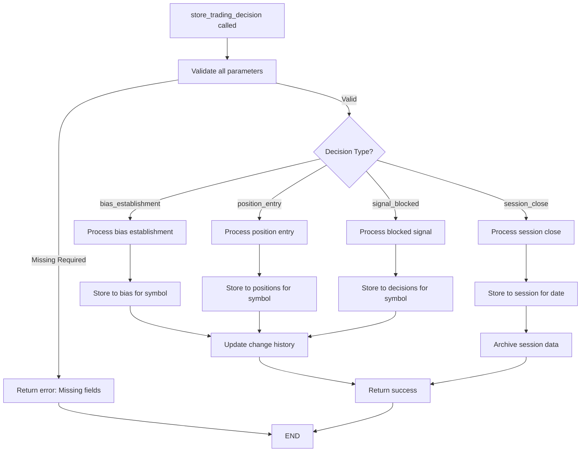
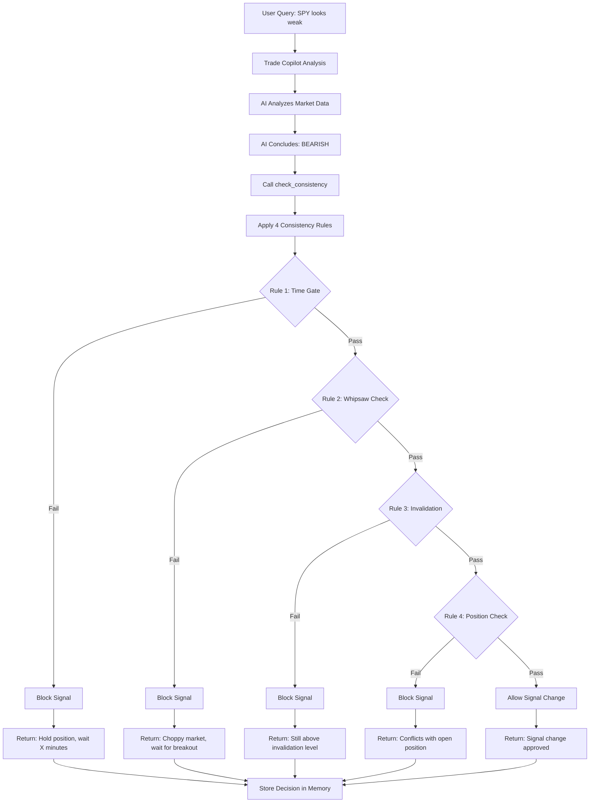
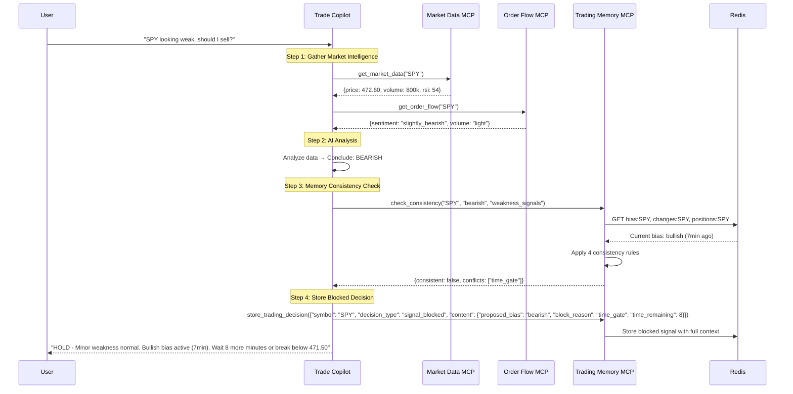
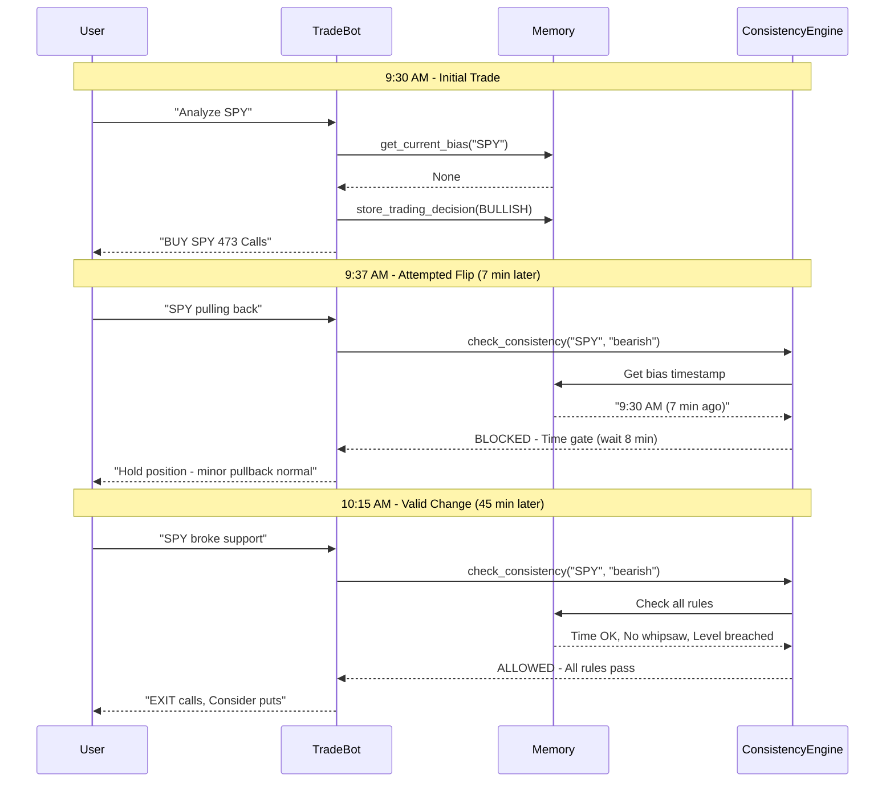
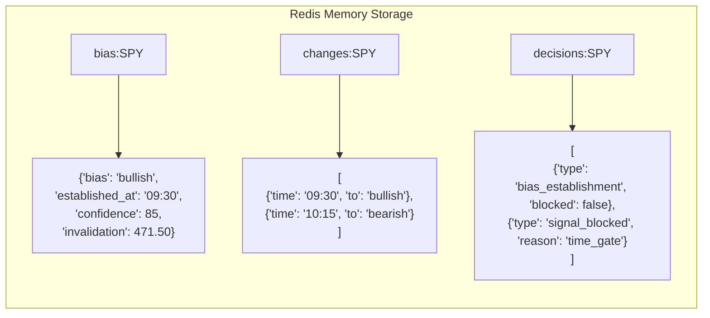

## What is the main problem
- We need to solve "LLM trading amnesia" - the core problem where each query is analyzed in isolation without context from previous decisions.

- The goal is to build tools which can solve this problem, I'm going to allow LLM to invoke memory tools

## Integration Flow with Trade Copilot

### Complete Request-Response Cycle with Detailed Tool Calls



## Architectural Design / Consideration

### Whipsaws Prevention with Complete Tool Calls



## Core Tools Summary
1. **get_current_bias** ✅ Retrieves established market bias and context
2. **store_trading_decision** ✅ Stores all trading decisions with full audit trail  
3. **check_consistency** ✅ Validates new signals against 4 consistency rules

**Removed:** `get_active_positions` - Position tracking handled within bias context

---
# Core Tools Input/Output Specifications

## Tool 1: `get_current_bias`

**Purpose**: Retrieve established market bias and timing context for symbol

### Input Parameters
```json
{
  "name": "get_current_bias",
  "arguments": {
    "symbol": "SPY"                    // Required: Trading symbol (e.g., SPY, QQQ, AAPL)
  }
}
```

### Output Format

#### Success Response
```json
{
  "bias": "bullish",                    // Current bias: bullish/bearish/neutral
  "established_at": "2024-01-15T09:45:00Z", // ISO timestamp when bias was set
  "confidence": 85,                     // Confidence level (1-100)
  "invalidation_level": 471.50,         // Price level that invalidates bias
  "time_held_minutes": 23,              // Minutes since bias establishment
  "reasoning": "Breaking above VWAP with volume confirmation", // Original reasoning
  "market_condition": "normal"           // Market state when established
}
```

#### No Bias Response
```json
{
  "bias": null,
  "message": "No bias established for SPY",
  "suggestion": "Establish initial bias based on market analysis"
}
```

#### Error Response
```json
{
  "error": "storage_unavailable",
  "message": "Unable to connect to memory storage",
  "fallback": "Continue without memory context"
}
```

---

## Tool 2: `store_trading_decision`

**Purpose**: Store important trading decisions with full context



#### Algorithm Details:

```
FUNCTION store_trading_decision(symbol, decision_type, content):
    1. INPUT VALIDATION:
       - Validate symbol format
       - Check decision_type in allowed values
       - Validate content structure based on type
       - Return detailed error if validation fails
    
    2. DECISION TYPE ROUTING:
       
       IF decision_type == "bias_establishment":
           - Validate bias in ["bullish", "bearish", "neutral"]
           - Require invalidation_level for directional bias
           - Require confidence score (1-100)
           - Store to: "bias:{symbol}"
           
       IF decision_type == "position_entry":
           - Validate position direction
           - Store entry price and size
           - Link to current bias
           - Store to: "positions:{symbol}"
           
       IF decision_type == "signal_blocked":
           - Store block reason (time_gate, whipsaw, etc.)
           - Store original proposed signal
           - Increment block counter
           - Store to: "decisions:{symbol}"
           
       IF decision_type == "session_close":
           - Calculate session P&L
           - Store key decisions summary
           - Archive to daily storage
           - Store to: "session:{date}"
    
    3. REDIS STORAGE:
       - Use Redis transactions for consistency
       - Set appropriate TTL for each data type
       - Handle storage failures with retries
    
    4. HISTORY TRACKING:
       - Add entry to "changes:{symbol}" list
       - Maintain last N decisions for consistency checking
       - Trim old entries based on configured limits
    
    5. CROSS-REFERENCE UPDATES:
       - Update related keys (bias affects positions)
       - Maintain data consistency across keys
       - Handle partial failure scenarios
    
    RETURN {
        "success": true,
        "stored_at": "timestamp",
        "decision_id": "unique_id",
        "expires_at": "timestamp"
    }
```

### Input Examples by Decision Type

#### Bias Establishment
```json
{
  "name": "store_trading_decision",
  "arguments": {
    "symbol": "SPY",
    "decision_type": "bias_establishment",
    "content": {
      "bias": "bullish",
      "reasoning": "Breaking above VWAP resistance at 472.50 with 2x average volume, RSI showing momentum but not overbought",
      "confidence": 85,
      "invalidation_level": 471.20,
      "key_levels": {
        "support": 471.20,
        "resistance": 474.50
      },
      "market_condition": "normal"
    }
  }
}
```

#### Signal Blocked
```json
{
  "name": "store_trading_decision",
  "arguments": {
    "symbol": "SPY",
    "decision_type": "signal_blocked",
    "content": {
      "proposed_bias": "bearish",
      "proposed_reasoning": "Minor pullback from highs",
      "block_reason": "time_gate",
      "block_details": {
        "time_remaining_minutes": 8,
        "current_bias": "bullish",
        "current_price": 472.40,
        "invalidation_level": 471.20
      }
    }
  }
}
```

#### Position Entry
```json
{
  "name": "store_trading_decision",
  "arguments": {
    "symbol": "SPY",
    "decision_type": "position_entry",
    "content": {
      "direction": "long",
      "instrument": "SPY_473C_20240119",
      "entry_price": 1.25,
      "size": 5,
      "reasoning": "Aligns with bullish bias, entry at VWAP support",
      "linked_bias": "bullish"
    }
  }
}
```

### Output Format

#### Success Response
```json
{
  "success": true,
  "stored_at": "2024-01-15T09:45:23Z",
  "decision_id": "dec_spy_20240115_094523",
  "expires_at": "2024-01-16T09:45:23Z",
  "storage_details": {
    "redis_key": "bias:SPY",
    "history_updated": true,
    "cross_references": ["current_bias", "symbol_history"]
  }
}
```

#### Error Response
```json
{
  "success": false,
  "error": "validation_failed",
  "message": "Invalid bias value: must be bullish, bearish, or neutral",
  "details": {
    "field": "content.bias",
    "provided_value": "sideways",
    "allowed_values": ["bullish", "bearish", "neutral"]
  }
}
```

---

## Tool 3: `check_consistency`


**Purpose**: Validates new signals against recent decisions to prevent contradictory trading

### Input Parameters

```json
{
  "name": "check_consistency",
  "arguments": {
    "symbol": "SPY",                    // Required: Trading symbol
    "proposed_bias": "bearish",         // Required: New bias (bullish/bearish/neutral)
    "reasoning": "failed breakdown",    // Required: Why changing bias
    "proposed_action": "sell_calls",    // Optional: Specific action
    "override_time_gate": false,        // Optional: Force override (dangerous)
    "market_condition": "choppy"        // Optional: Current market state
  }
}
```

### Output Format

```json
{
  "consistent": false,                  // Can proceed with signal?
  "conflicts": [                        // List of rule violations
    {
      "type": "time_gate",             // Rule type
      "severity": "high",              // high/medium/low
      "message": "Bias change within 15 minutes",
      "current_value": "7 minutes",
      "threshold": "15 minutes",
      "time_remaining": "8 minutes"
    }
  ],
  "recommendation": "block_signal",     // block_signal/proceed/caution
  "guidance": "Wait 8 minutes before bias change",
  "context": {
    "current_bias": "bullish",
    "established_at": "2024-01-15T09:30:00Z",
    "time_held": "7 minutes",
    "confidence": 85,
    "invalidation_level": 471.50,
    "recent_changes": 1
  },
  "debug_info": {                       // For troubleshooting
    "rules_checked": ["time_gate", "whipsaw", "invalidation", "position"],
    "current_price": 472.60,
    "processing_time_ms": 12
  }
}
```

## High-Level Workflow



## Configuration Parameters

```json
{
  "consistency_rules": {
    "time_gate": {
      "enabled": true,
      "default_minutes": 15,
      "0dte_minutes": 20,
      "override_allowed": false
    },
    "whipsaw_detection": {
      "enabled": true,
      "max_changes_per_hour": 2,
      "lookback_minutes": 60,
      "choppy_market_threshold": 3
    },
    "invalidation_enforcement": {
      "enabled": true,
      "require_level_breach": true,
      "buffer_percent": 0.05
    },
    "position_protection": {
      "enabled": true,
      "allow_override": false,
      "check_open_orders": true
    }
  },
  "market_conditions": {
    "normal": {
      "time_gate_minutes": 15,
      "max_changes_hour": 2
    },
    "volatile": {
      "time_gate_minutes": 20,
      "max_changes_hour": 1
    },
    "choppy": {
      "time_gate_minutes": 25,
      "max_changes_hour": 1
    }
  }
}
```

## Complete Integration Workflow




## Real-World Example Flow



## What Gets Stored in Memory



---

## Complete First Call and Follow-up Examples

### Example 1: Morning Bias Establishment (First Call)

### User Input
**User:** *"What's SPY looking like this morning?"*

### LLM Tool Call Sequence

1. **Check for existing bias:**
```json
{
  "name": "get_current_bias",
  "arguments": {
    "symbol": "SPY"
  }
}
```
**Response:**
```json
{
  "bias": null,
  "message": "No bias established for SPY",
  "suggestion": "Establish initial bias based on market analysis"
}
```

2. **LLM gets market data and concludes bullish, then stores decision:**
```json
{
  "name": "store_trading_decision",
  "arguments": {
    "symbol": "SPY",
    "decision_type": "bias_establishment",
    "content": {
      "bias": "bullish",
      "reasoning": "Gap up above previous high 471.90, holding above VWAP with 1.5x average volume in first 30min",
      "confidence": 80,
      "invalidation_level": 471.20,
      "market_condition": "normal"
    }
  }
}
```
**Response:**
```json
{
  "success": true,
  "stored_at": "2024-01-15T09:30:15Z",
  "decision_id": "dec_spy_20240115_093015",
  "expires_at": "2024-01-16T09:30:15Z"
}
```

### User Response
**LLM:** *"SPY BULLISH BIAS ESTABLISHED - Gap up above yesterday's high with strong volume. Current: 472.80, above VWAP support. Invalidation level: 471.20. Consider SPY calls on any VWAP retest."*

---

### Example 2: Follow-up Call - Signal Blocked (7 minutes later)

### User Input
**User:** *"SPY is pulling back, should I exit?"*

### LLM Tool Call Sequence

1. **Check current bias:**
```json
{
  "name": "get_current_bias",
  "arguments": {
    "symbol": "SPY"
  }
}
```
**Response:**
```json
{
  "bias": "bullish",
  "established_at": "2024-01-15T09:30:15Z",
  "confidence": 80,
  "invalidation_level": 471.20,
  "time_held_minutes": 7,
  "reasoning": "Gap up above previous high 471.90, holding above VWAP with 1.5x average volume",
  "market_condition": "normal"
}
```

2. **LLM sees minor pullback, wants to check if bearish change is valid:**
```json
{
  "name": "check_consistency",
  "arguments": {
    "symbol": "SPY",
    "proposed_bias": "bearish",
    "reasoning": "Minor pullback from morning highs",
    "proposed_action": "exit_position"
  }
}
```
**Response:**
```json
{
  "consistent": false,
  "conflicts": [
    {
      "type": "time_gate",
      "severity": "high",
      "message": "Bias change within 15 minutes of establishment",
      "time_remaining": "8 minutes",
      "current_value": "7 minutes",
      "threshold": "15 minutes"
    }
  ],
  "recommendation": "block_signal",
  "guidance": "Wait 8 minutes before bias change or until price breaks below 471.20",
  "context": {
    "current_bias": "bullish",
    "established_at": "2024-01-15T09:30:15Z",
    "time_held": "7 minutes",
    "confidence": 80,
    "invalidation_level": 471.20,
    "recent_changes": 0
  }
}
```

3. **LLM stores the blocked signal:**
```json
{
  "name": "store_trading_decision",
  "arguments": {
    "symbol": "SPY",
    "decision_type": "signal_blocked",
    "content": {
      "proposed_bias": "bearish",
      "proposed_reasoning": "Minor pullback from morning highs",
      "block_reason": "time_gate",
      "block_details": {
        "time_remaining_minutes": 8,
        "current_bias": "bullish",
        "current_price": 472.40,
        "invalidation_level": 471.20
      }
    }
  }
}
```
**Response:**
```json
{
  "success": true,
  "stored_at": "2024-01-15T09:37:23Z",
  "decision_id": "dec_spy_20240115_093723"
}
```

### User Response
**LLM:** *"HOLD POSITION - Minor pullback is normal in bullish setup. Bias established only 7 minutes ago. Wait 8 more minutes or exit only if break below invalidation level 471.20. Current: 472.40 (still valid)."*

---

### Example 3: Valid Follow-up Call - Change Allowed (45 minutes later)

### User Input
**User:** *"SPY broke below support, what now?"*

### LLM Tool Call Sequence

1. **Check current bias:**
```json
{
  "name": "get_current_bias",
  "arguments": {
    "symbol": "SPY"
  }
}
```
**Response:**
```json
{
  "bias": "bullish",
  "established_at": "2024-01-15T09:30:15Z",
  "confidence": 80,
  "invalidation_level": 471.20,
  "time_held_minutes": 45,
  "reasoning": "Gap up above previous high with strong volume",
  "market_condition": "normal"
}
```

2. **LLM sees price at 471.10 (below invalidation), wants to change to bearish:**
```json
{
  "name": "check_consistency",
  "arguments": {
    "symbol": "SPY",
    "proposed_bias": "bearish",
    "reasoning": "Broke below invalidation level 471.20, now at 471.10",
    "proposed_action": "exit_longs_consider_puts"
  }
}
```
**Response:**
```json
{
  "consistent": true,
  "conflicts": [],
  "recommendation": "proceed",
  "guidance": "Signal change approved - invalidation level breached",
  "context": {
    "current_bias": "bullish",
    "established_at": "2024-01-15T09:30:15Z",
    "time_held": "45 minutes",
    "confidence": 80,
    "invalidation_level": 471.20,
    "current_price": 471.10,
    "level_breached": true
  }
}
```

3. **LLM stores the new bearish bias:**
```json
{
  "name": "store_trading_decision",
  "arguments": {
    "symbol": "SPY",
    "decision_type": "bias_establishment",
    "content": {
      "bias": "bearish",
      "reasoning": "Failed to hold above 471.20 invalidation level, now showing weakness below key support",
      "confidence": 75,
      "invalidation_level": 472.50,
      "market_condition": "normal"
    }
  }
}
```
**Response:**
```json
{
  "success": true,
  "stored_at": "2024-01-15T10:15:30Z",
  "decision_id": "dec_spy_20240115_101530"
}
```

### User Response
**LLM:** *"BIAS CHANGE TO BEARISH - SPY broke below invalidation level 471.20, now at 471.10. Previous bullish thesis invalidated after 45 minutes. EXIT long positions. New invalidation: 472.50. Consider SPY puts on any bounce to VWAP."*

---
