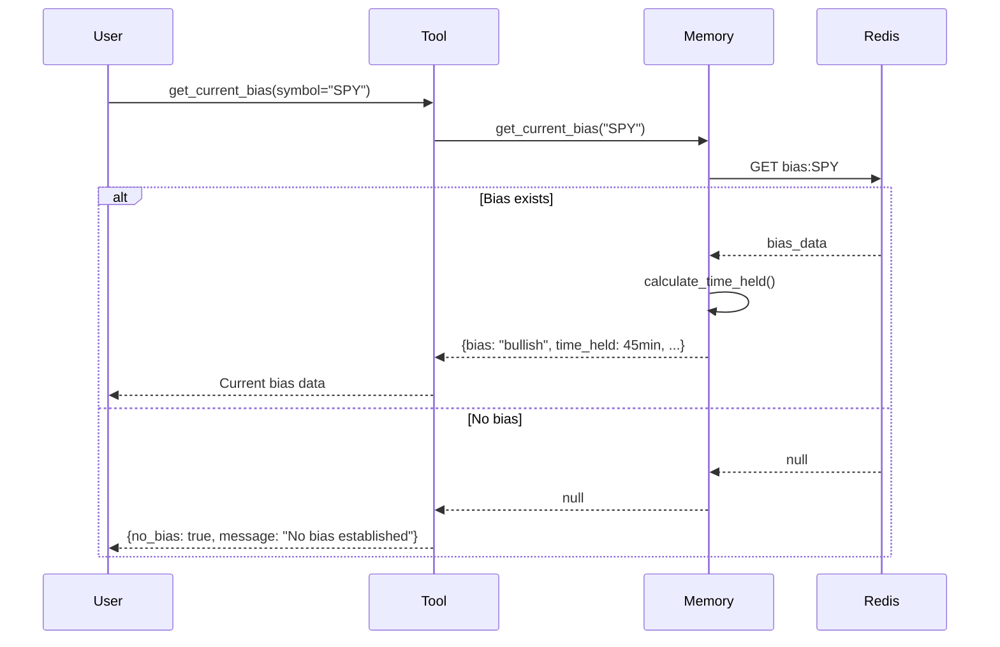
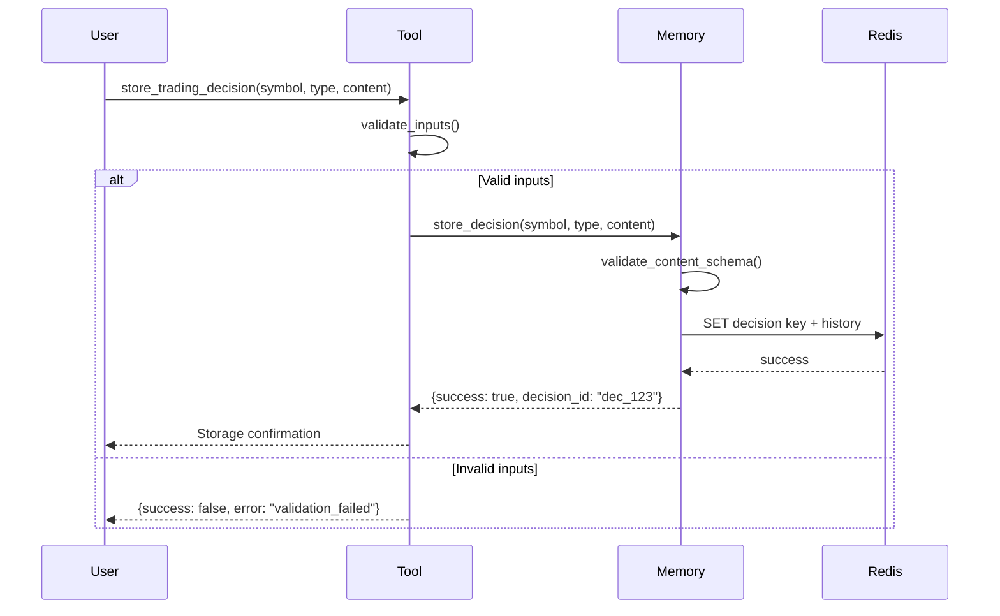
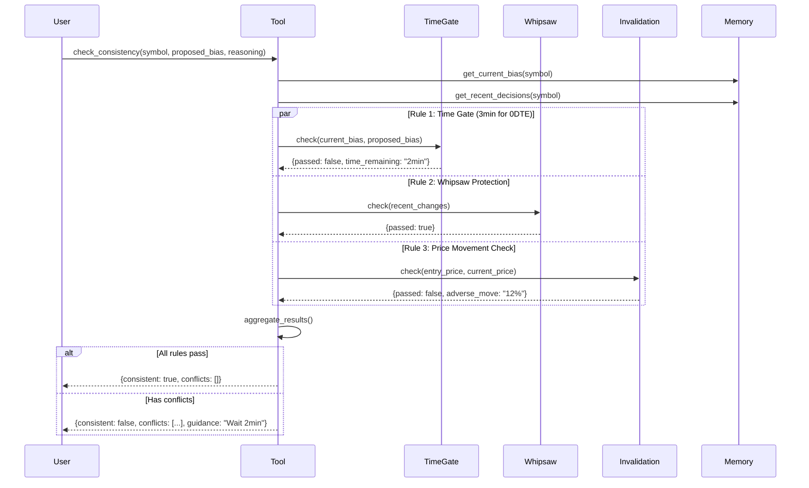
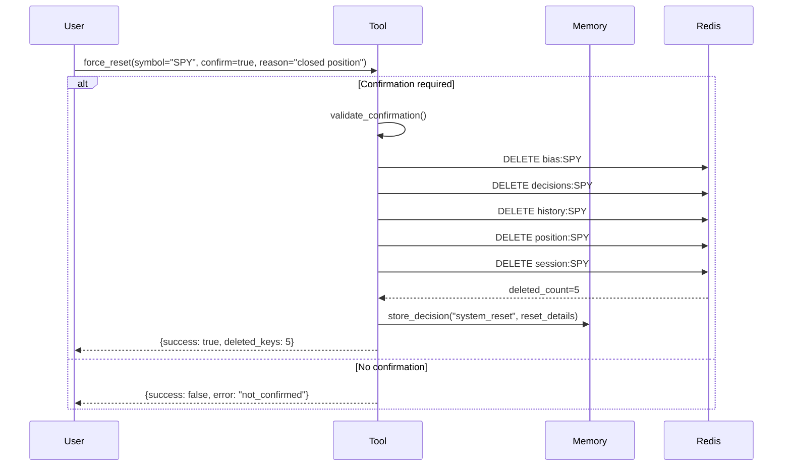
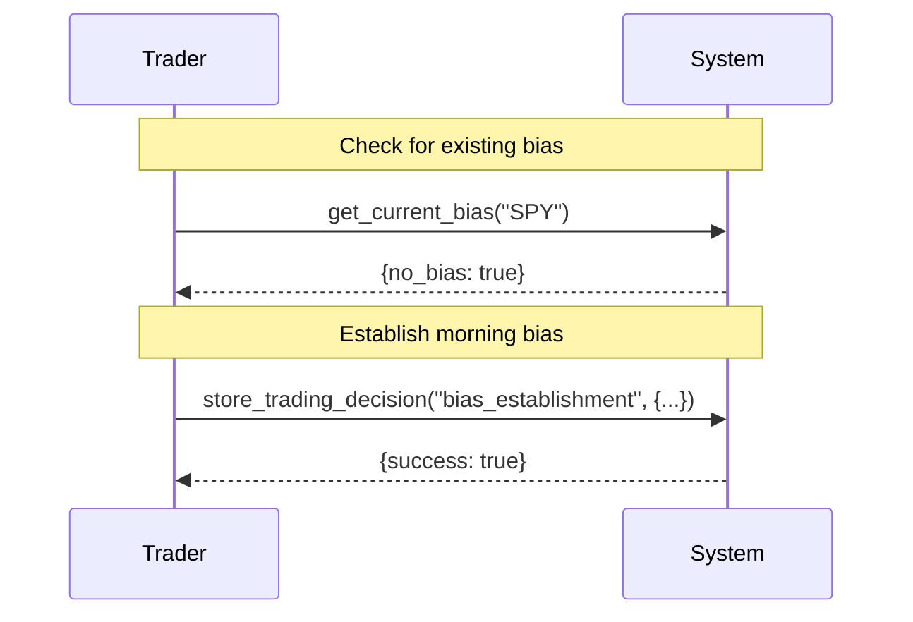
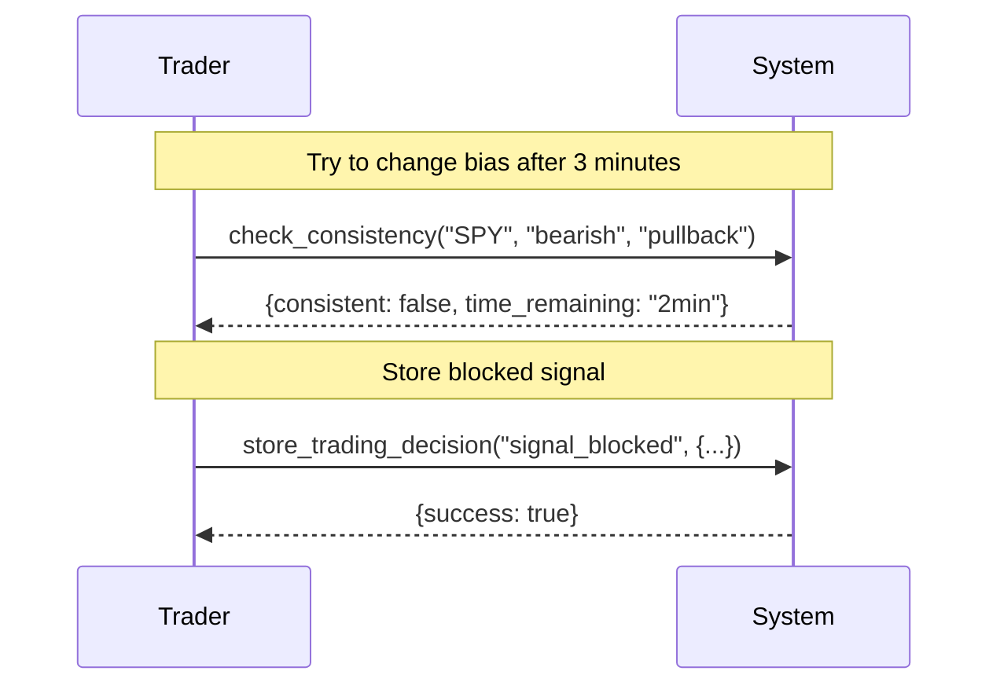
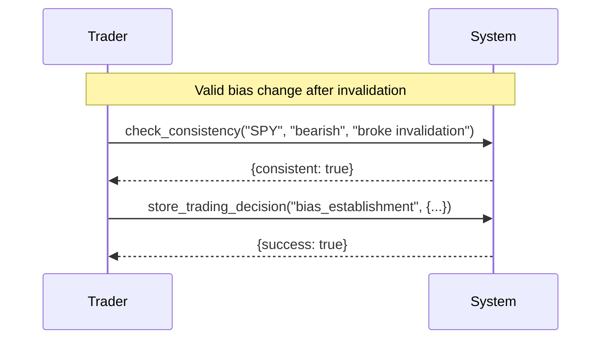
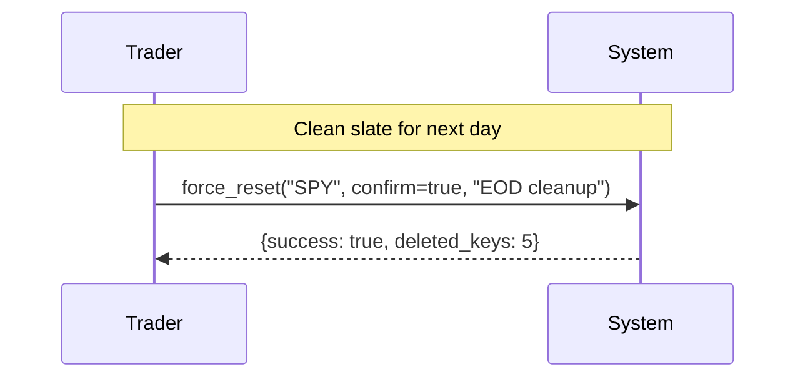

# MCP Trading Memory - Tools Workflow

Complete workflow documentation for 0DTE trading with sequence diagrams.

## Overview

This system provides 4 core tools for 0DTE options trading:
1. **get_current_bias** - Retrieve current market bias
2. **store_trading_decision** - Store trading decisions
3. **check_consistency** - Validate new signals against rules
4. **force_reset** - Clean all data for a symbol

## Configuration (Hardcoded Constants)

```python
# 0DTE Trading Settings
TIME_GATE_MINUTES = 3  # Fast decisions for 0DTE
WHIPSAW_MAX_CHANGES_PER_HOUR = 2
PRICE_MOVEMENT_THRESHOLDS = [
    5%,   # Warning
    10%,  # High severity 
    20%   # Critical - force stop
]
```

## Tool 1: get_current_bias

**Purpose**: Check existing bias and timing context

### Sequence Diagram


### Example Response
```json
{
  "symbol": "SPY",
  "bias": "bullish",
  "confidence": 85,
  "time_held_minutes": 45,
  "invalidation_level": 471.20,
  "established_at": "2024-01-15T09:30:15Z"
}
```

---

## Tool 2: store_trading_decision

**Purpose**: Store all trading decisions with context

### Sequence Diagram


### Decision Types

#### 1. Bias Establishment
```json
{
  "symbol": "SPY",
  "decision_type": "bias_establishment",
  "content": {
    "bias": "bullish",
    "reasoning": "Breaking above VWAP with 2x volume",
    "confidence": 85,
    "invalidation_level": 471.20
  }
}
```

#### 2. Position Entry
```json
{
  "symbol": "SPY", 
  "decision_type": "position_entry",
  "content": {
    "direction": "long",
    "entry_price": 473.50,
    "size": 5,
    "reasoning": "0DTE calls at support"
  }
}
```

---

## Tool 3: check_consistency

**Purpose**: Validate signals against 3 consistency rules for 0DTE

### Sequence Diagram


### Consistency Rules for 0DTE

#### Rule 1: Time Gate (3 Minutes)
- **Purpose**: Prevent emotional rapid-fire changes
- **0DTE Logic**: 3 minutes minimum between bias changes
- **Block**: Changes within 3 minutes unless override

#### Rule 2: Whipsaw Protection 
- **Purpose**: Limit flip-flopping
- **Logic**: Max 2 changes per hour
- **Block**: Excessive changes in short timeframe

#### Rule 3: Price Movement Protection
- **Purpose**: Stop loss on adverse moves
- **Thresholds**:
  - 5% adverse move: Warning
  - 10% adverse move: High severity
  - 20% adverse move: Critical - force stop
- **Block**: Maintaining bias after significant adverse move

### Example Blocked Response
```json
{
  "consistent": false,
  "conflicts": [
    {
      "type": "time_gate",
      "severity": "high", 
      "message": "Bias change within 3 minutes (0DTE rule)",
      "time_remaining": "2 minutes"
    },
    {
      "type": "adverse_price_movement",
      "severity": "critical",
      "message": "Price moved 12% against position",
      "entry_price": 473.50,
      "current_price": 416.68
    }
  ],
  "recommendation": "block_signal",
  "guidance": "Wait 2 minutes OR close position due to 12% adverse move"
}
```

---

## Tool 4: force_reset

**Purpose**: Clean slate - wipe all data for symbol

### Sequence Diagram


### Usage
```json
{
  "symbol": "SPY",
  "confirm": true,
  "reason": "Closed all positions manually"
}
```

---

## Complete Trading Workflow

### Morning Setup (9:30 AM)


### Signal Change Attempt (9:33 AM)


### Valid Change (9:45 AM)


### End of Day Cleanup


---

## Error Handling

### Redis Connection Issues
- **Fallback**: Continue without memory (log warning)
- **Response**: Include `fallback` field in responses

### Invalid Data
- **Validation**: Strict schema validation on all inputs
- **Response**: Clear error messages with correction guidance

### Server Not Ready
- **Check**: All tools verify `server_ready` state
- **Response**: Graceful error with retry guidance

---

## Integration Notes

1. **Import**: `from fastmcp import FastMCP`
2. **Tools**: Auto-registered via `@app.tool()` decorators
3. **Startup**: Initialize Redis connection first
4. **Shutdown**: Graceful cleanup of connections
5. **Logging**: Structured JSON logging for all operations

This system is optimized for fast 0DTE decision-making while preventing costly emotional mistakes.